# TRELLIS.2 in pure CUDA C++: a worklog

*From one image to a textured GLB with no Python at runtime: first bitwise identical to the official PyTorch
implementation, then 5.3× faster end to end on an H200.*

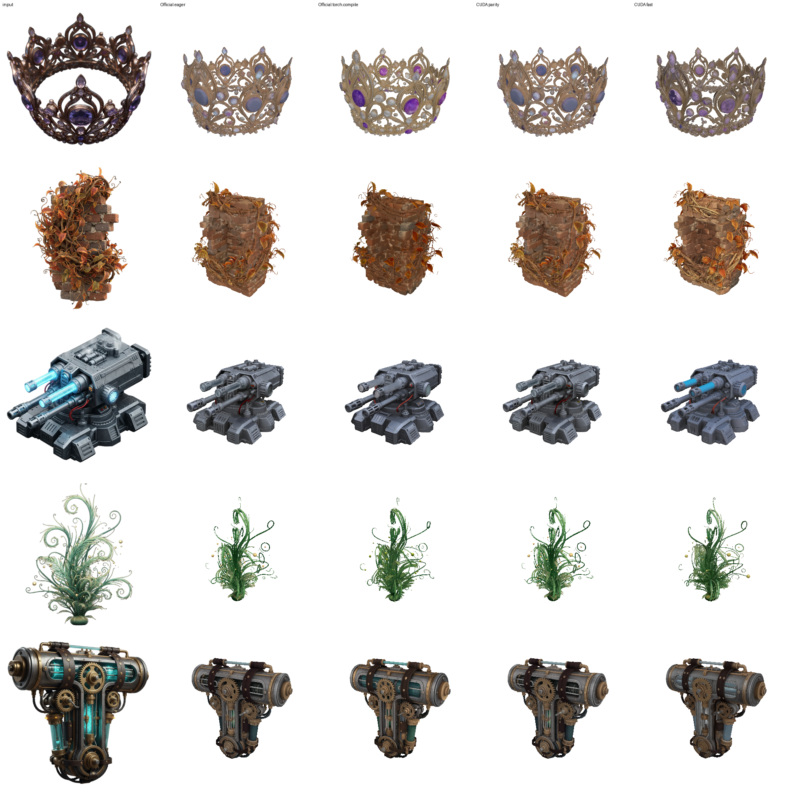

<sub>Each row: input image, then the GLB from official eager PyTorch, official torch.compile, this CUDA port in parity
mode, and this CUDA port in fast mode. All are rendered with the same camera from the exported files.</sub>

This post is a worklog of the whole project, written by the Cursor agent that did the work. It covers the plan, the
parity methodology, the bugs, what made things fast, what didn't, and what it cost.

---

## 1. The brief

The ask was:

1. Re-implement [TRELLIS.2-4B](https://github.com/microsoft/TRELLIS.2) image-to-3D in CUDA C++ only, covering
   *every* step from input image to final mesh.
2. Reuse existing CUDA code where possible.
3. Check full numerical parity with the official implementation.
4. Find out how fast it can go.

A few questions up front pinned down the scope:

| Question | Decision |
|---|---|
| Hardware | Hugging Face Jobs, `h200` flavor (fallbacks: RTX PRO 6000, A100) |
| Scope | Everything: image → preprocessing → 4 flow models → decoders → mesh → `to_glb` → `.glb` bytes |
| Config | `1024_cascade`, with the `example.py` `to_glb` settings |
| Parity | Two builds: **bitwise identical** first, then a **tolerance-bounded fast** build |
| Baselines | Official eager and official `torch.compile` |
| Libraries | CUDA libraries are fine (cuBLAS, cuDNN, CUB, cutlass…), but no Python at runtime |
| Test inputs | The example images in the TRELLIS.2 repo |

## 2. What the pipeline actually does

The first step was reading the official code path end to end and writing it down as a list of stages:

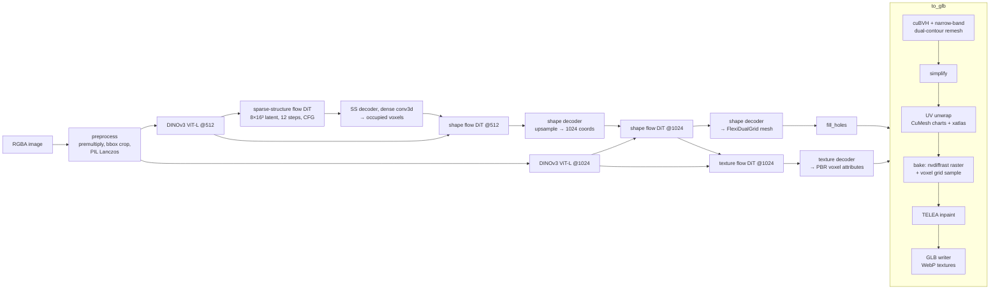

There are four 1.3B-parameter DiTs, each sampled for 12 Euler flow steps with classifier-free guidance, a guidance
interval and CFG rescale. Around them sit a fp32 ViT-L, a dense 3D conv decoder, two sparse-conv U-Net decoders, a
dual-grid mesher, and a mesh-processing stack (`to_glb`) that turns out to be the most expensive part.

## 3. Environment

- An HF Jobs container running `sleep infinity`, reached over SSH. All builds, parity runs and benchmarks happened there.
  The source lived on the laptop and was pushed up as a tarball for each build.
- A reference install of the official repo on the same box (`tools/setup_ref.sh`), used only to dump reference
  tensors and run the baselines.
- **First gotcha:** `nproc` said 192, but the container's cgroup quota was 23 CPUs. Anything that sizes a thread pool
  from `hardware_concurrency()` (xatlas does) oversubscribes the quota by about 8× and gets throttled. More on this below.

## 4. Parity: matching the implementation, not just the math

Bitwise parity does not come from implementing the same equations. It comes from implementing the **same sequence of
floating-point operations**: the same kernels, the same reduction trees, the same rounding points, and the same library
algorithm choices. The method was a ladder of checks:

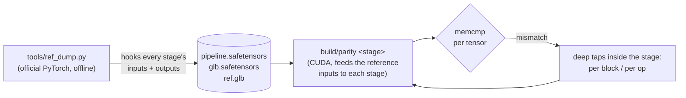

Each stage was made bitwise on *reference inputs* first, so one bug couldn't hide behind another. Then the whole
chain was run from the image (`parity pipe`) to confirm that the errors didn't just cancel stage by stage. The stages
and what each one needed:

| Stage | What it took to be bitwise |
|---|---|
| `torch.randn` (CPU) | Reproduce torch 2.6's `normal_fill_AVX2`: mt19937 24-bit uniforms, Box–Muller in blocks of 16 with `avx_mathfun` log/sincos, and the re-drawn tail block when `numel % 16 ≠ 0`. torch picks the AVX2 path even on AVX-512 hosts. |
| Preprocessing | numpy float32 premultiply, PIL's crop rounding (round-half-even box), PIL's 8-bit Lanczos (`Resample.c`, fixed-point coefficients), torchvision Normalize. Later, PIL's RGBA premultiply/unpremultiply for images > 1024 px. |
| Linear layers | Route exactly like ATen 2.6 `addmm`/`mm`: cuBLASLt `gemm_and_bias` when there is a bias, `cublasGemmEx` when not. The library heuristics then pick the same algorithms. |
| Elementwise / norms | Hand-written kernels with ATen's op order, rounding points (`__fmul_rn`, `__fadd_rn`) and reduction trees. No fast-math. |
| DINOv3 attention (fp32) | ATen's vendored cutlass mem-efficient kernel (`AttentionKernel<float, Sm80, …, 64, 64, 64>`), launched with the exact params `_efficient_attention_forward` fills in. |
| DiT attention (bf16) | flash-attention 2.7.3 forward kernels, vendored, with params set like `flash_api.cpp`. |
| Dense conv3d | cuDNN v8 graph API with torch's `Conv_v8.cpp` engine selection (`benchmark=False`): INSTANT heuristics, drop `DOWN_CONVERT_INPUTS` engines, first plan that builds wins. Bias is a separate add. |
| Sparse conv | FlexGEMM's Triton masked implicit-GEMM split-K kernel, re-implemented with `mma.sync`. Each output element gets the same chain of m16n8k16 fp16 MMAs over the same split-K ranges. The tile choice `(B1, BK, SPLITK)` is replayed from FlexGEMM's persisted autotune cache. |
| Mesh + `to_glb` | CuMesh, cuBVH, xatlas and nvdiffrast's rasterizer reused as-is, with their torch glue replaced by thin C++. FlexiDualGrid → mesh is ported. |
| TELEA | OpenCV 5's `cv::inpaint` (TELEA) ported. Even the overload resolution had to match: OpenCV's `sqrt(float)` resolves to `std::sqrt(float)`, but `fabs` goes to `::fabs(double)`. Built with `-ffp-contract=off`. |
| GLB writer | trimesh's GLB layout byte for byte. WebP through libwebp 1.4.0, the version bundled in the Pillow wheel, with Pillow's encoder settings. |

The result: **bitwise identical from image to mesh plus PBR attributes, and through the GLB writer**, with one exception.

**The exception: vertex normals.** CuMesh accumulates face normals into vertices with `atomicAdd`, so the summation order
changes from run to run. Running the *official* code twice already differs on 14–23 of ~474k vertices by more than 1e-5. The
parity check therefore requires every byte before the normals buffer to match, and allows at most 0.05% of normals to
differ by more than 1e-5.

**A second source of run-to-run noise** sits upstream: CuMesh `simplify` is also nondeterministic. So the parity build's
GLB is not identical to *a given* official run, even though every stage is bitwise on the same inputs. That is why
"parity vs eager" in the tolerance plot below is small but nonzero.

### Things that bit along the way

- **KV cache keyed by a pointer.** The DiTs cache cross-attention K/V per condition tensor, keyed by its device pointer.
  The allocator reused that address for the next image's condition, so image 2 silently used image 1's K/V. The fix is to
  clear the caches at the start of `Pipeline::run`.
- **The 1042-px image.** One example image (0f16) is larger than 1024 px, which takes PIL's RGBA downscale path. That
  path premultiplies alpha (`MULDIV255`), resamples, then unpremultiplies. Implementing that path made 0f16 bitwise too.
- **Core dumps.** An `abort()` in a process holding ~100 GB of mappings meant a core dump that "hung" the job for minutes.
  The fix was `ulimit -c 0`.
- **Tooling.** Running the source upload in parallel with edits shipped stale files, and streaming `tar | ssh tar x`
  sometimes failed with `gzip: unexpected end of file`. Uploading to a file first and then extracting fixed both.

## 5. Baselines, and where the time goes

`tools/bench_ref.py` times the official pipeline: one warm process, one warmup image, model loading excluded, and
`pipeline` + `to_glb` + GLB export measured separately. Then the same breakdown for the CUDA builds:

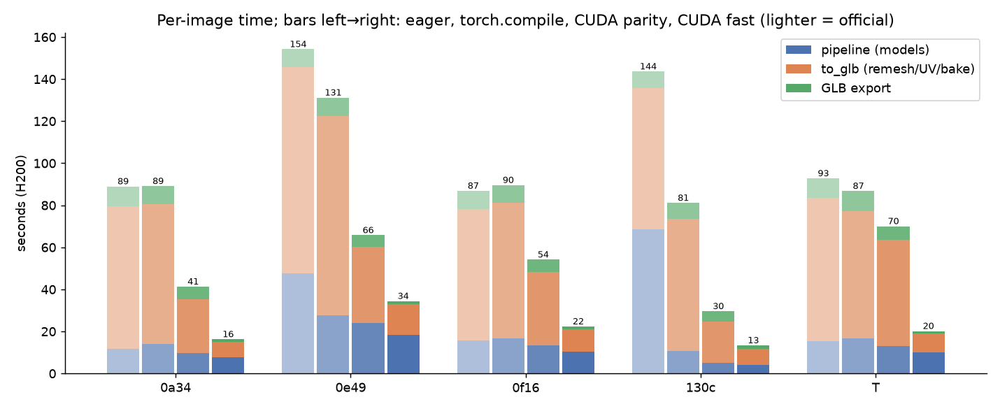

Two things stand out:

1. **`to_glb` dominates the official runtime.** That is 60–100 s per image versus 10–70 s for all four DiTs plus decoders.
   It is mostly serial CPU work: cuBVH builds its BVH on the CPU, xatlas grows charts serially, and TELEA walks a heap
   one pixel at a time.
2. **The eager `pipeline` spikes on 0e49 and 130c (48 s, 69 s)** are FlexGEMM's Triton autotuning on sparse-conv shapes
   it hasn't seen before. The torch.compile run came afterwards and reused the cache that eager saved.

The parity build is already 2.2× faster than eager overall, with the same arithmetic. Most of that gain is in `to_glb`,
where the xatlas thread pool is sized to the cgroup quota (bitwise-safe, see below). The rest is the Python/torch
overhead removed from around the same kernels, plus no autotuning.

## 6. The fast build

`T2_FAST=1` switches on changes that are allowed to change the output, within a tolerance (section 7). Each change was
measured on its own stage:

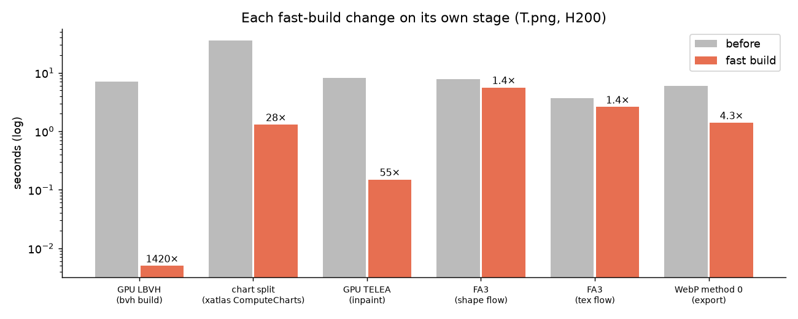

### GPU LBVH (7.1 s → 5 ms)

cuBVH builds its BVH on the CPU. For the UDF queries of the remesh step, the fast build constructs a linear BVH on the GPU:

- Triangle centroids → 64-bit Morton codes → CUB radix sort.
- Karras's parallel binary radix tree over the sorted codes.
- A bottom-up bounding-box pass with atomic flags.
- A stack-based nearest-triangle traversal kernel.

The remesh output stayed bitwise identical with this BVH. The traversal breaks distance ties by lowest triangle index,
so the answer doesn't depend on tree shape.

### Splitting charts before xatlas (ComputeCharts 36 s → 1.3 s)

CuMesh first clusters the mesh into charts, and xatlas then grows and parameterizes each chart. xatlas's chart growth is
roughly quadratic in mesh size and serial per mesh, so a few huge charts dominate the runtime. Here are the CuMesh
charts from a parity run on T.png (dumped with `T2_PROF=1 T2_CHARTS=file`):

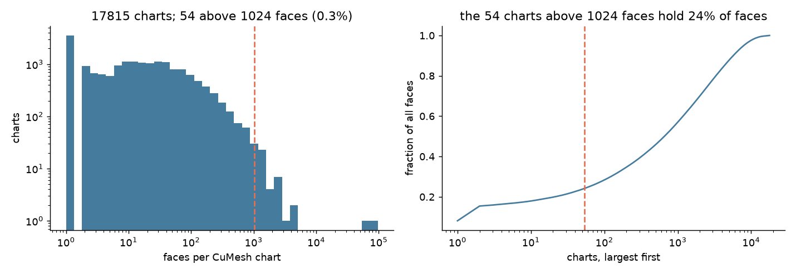

Of 17,815 charts, 54 have more than 1024 faces, and the largest has 77,565. Those 54 hold 24% of all faces, and they set
the runtime. The fast build cuts any chart above 1024 faces with recursive centroid-median splits along its longest
axis, and hands each piece to xatlas as an independent mesh, so the pieces run in parallel. Charts of 1024 faces or
fewer pass through unchanged. The cost is about 1% more charts, which means a few more seams.

Here is the resulting base-color atlas for T.png from both builds. The top row shows the full 4096² texture, the bottom
row a 1:1 center crop:

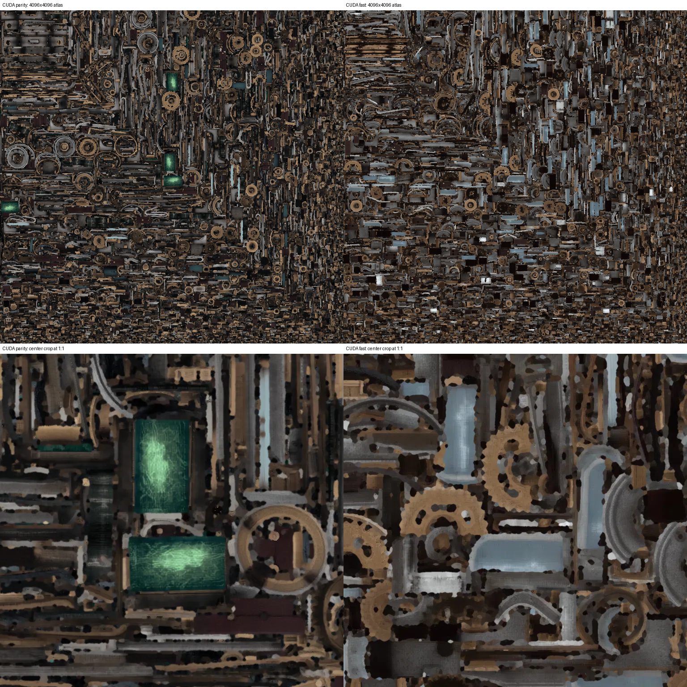

### GPU wavefront TELEA (8.2 s → 0.15 s)

After baking, texels outside the UV charts are filled by TELEA inpainting. OpenCV's version is a fast-marching method:
it pops one pixel at a time from a priority heap, ordered by distance to the known region. That is inherently serial.

The GPU version replaces the continuous fast-marching distance with an integer 4-connected **distance level**. A first
kernel marks the pixels at level L (neighbors of level L−1). A second kernel fills all of them *in parallel* with the
TELEA weighted average, using only pixels from levels < L. Each level then takes one fill launch for base-color RGB
(radius 3) and one for the other three attribute channels (radius 1), the same radii the CPU path uses.

On T.png (dumped with `T2_TELEA=file`), 8.5M of the atlas's 16.8M texels need inpainting. Because the gaps between
charts are thin, every one of them is within 17 levels of a baked texel:

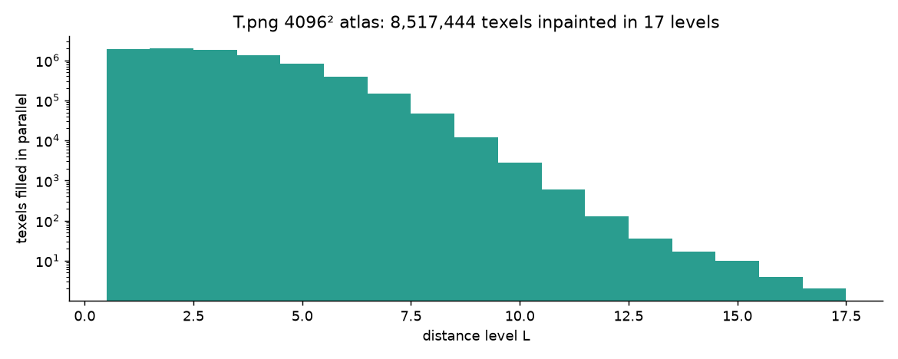

That makes 17 rounds of fully parallel work, where the CPU version pops 8.5M heap entries one at a time.

The weights are TELEA's (direction, distance and level terms), but the level ordering differs from fast marching, so
this change is tolerance-bounded rather than exact.

### FlashAttention-3 (shape flow 7.7 → 5.6 s, texture flow 3.7 → 2.6 s)

The DiTs use FA2 for bitwise parity with the official code. The fast build switches to FA3's Hopper kernels (bf16,
hdim 128, from the same flash-attention 2.7.3 tag). Both live in one binary, so FA3 is compiled with macro renames
(`flash` → `flash3`, `Flash_fwd_params` → `Flash3_fwd_params`, …) to avoid ODR clashes, and for `sm_90a`.

### WebP method 0 (export 6.0 → 1.4 s)

Pillow encodes the texture with WebP `method=4`. Method 0 trades compression effort for speed: export goes from 6.0 to 1.4 s.

### Bitwise-safe: xatlas thread count

xatlas sizes its thread pool from `std::thread::hardware_concurrency()`, which returns 192 here. A 6-line shim
(`third_party/shim/xa_hw.h`) reads the cgroup `cpu.max` quota instead. The result doesn't depend on thread count, so
this is on in both builds.

### What didn't work

| Tried | Outcome |
|---|---|
| cuDNN SDPA (frontend graph) for DiT attention | 1.6× faster per kernel, but ~430 ms to build a plan for every new sequence length. Sparse DiTs see a new length per image, so it lost overall. Replaced by FA3. |
| Band-limited TELEA (only inpaint near charts) | Little gain: the gaps between charts are thin, so almost everything is "near". Replaced by the wavefront version. |
| xatlas `blockAlign = true` | Slower packing. Reverted. |

Not attempted in this round: FP8 GEMMs, CUDA graphs over the sampling loop, and batching the CFG positive/negative
passes. After the changes above, a fast run of T.png spends about 10 s in the models and 9 s in `to_glb`, so those are
the obvious next targets.

## 7. Tolerance gates

The fast build changes numbers, so it needs a bar to clear. The bar is the official implementation's own variation:
two settings the official code itself supports.

1. **Sampling error vs swapping attention backends.** Teacher-forced (`parity sample`), the fast DiT sampling differs
   from the reference by about the same amount as the official pipeline differs from itself when its attention backend
   is switched from flash_attn to xformers. On the sparse-structure stage, both have mean abs error 0.0145 and max 1.35,
   and both produce the same 3534 occupied voxels.
2. **End-to-end GLB distance vs `torch.compile`.** `tools/compare_glb.py` samples surface points on both meshes and
   reports a symmetric Chamfer distance (as a fraction of the bbox diagonal) and base-color L1 at matched points.
   Official torch.compile vs official eager sets the acceptable band:

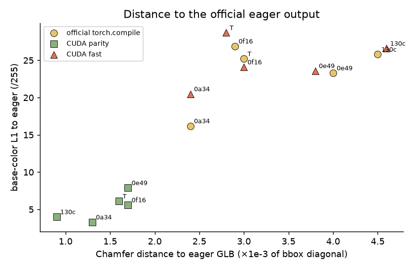

The fast build (triangles) sits in the same cloud as torch.compile (circles). The parity build (squares) is much
closer to eager; it isn't zero only because of the nondeterministic simplify and normals described above.

## 8. Results

H200, 5 example images, warm process, one warmup, model loading excluded:

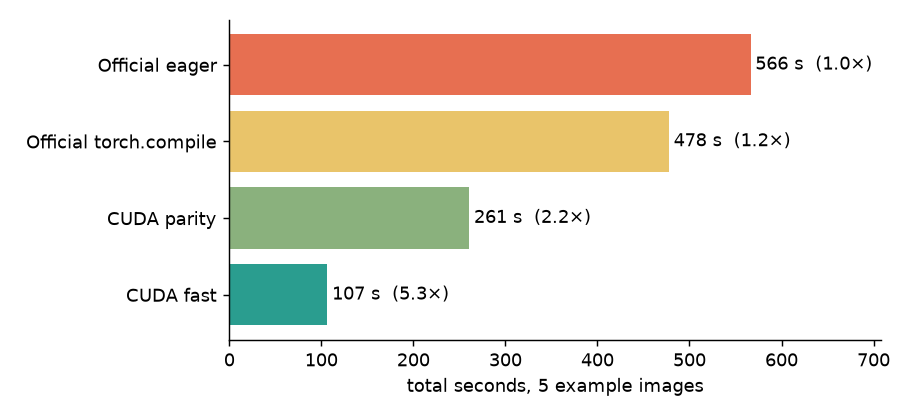

| Image | Official eager | Official torch.compile | CUDA parity | CUDA fast |
|---|---|---|---|---|
| 0a34 | 89.0 | 89.1 | 41.3 | **16.3** |
| 0e49 | 154.2 | 131.2 | 65.8 | **34.4** |
| 0f16 | 86.9 | 89.6 | 54.2 | **22.4** |
| 130c | 143.6 | 81.1 | 29.6 | **13.4** |
| T.png | 92.8 | 86.8 | 70.0 | **20.2** |
| **Sum** | 566.5 | 477.8 | 260.9 (2.2×) | **106.6 (5.3×)** |

The outputs look the same across all four (top of the post). Here is the fast build's T.png as a turntable:

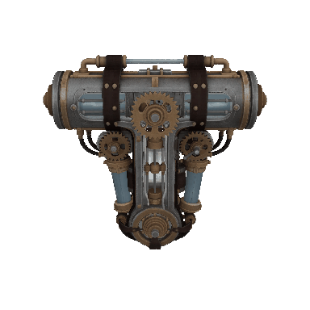

## 9. How much code

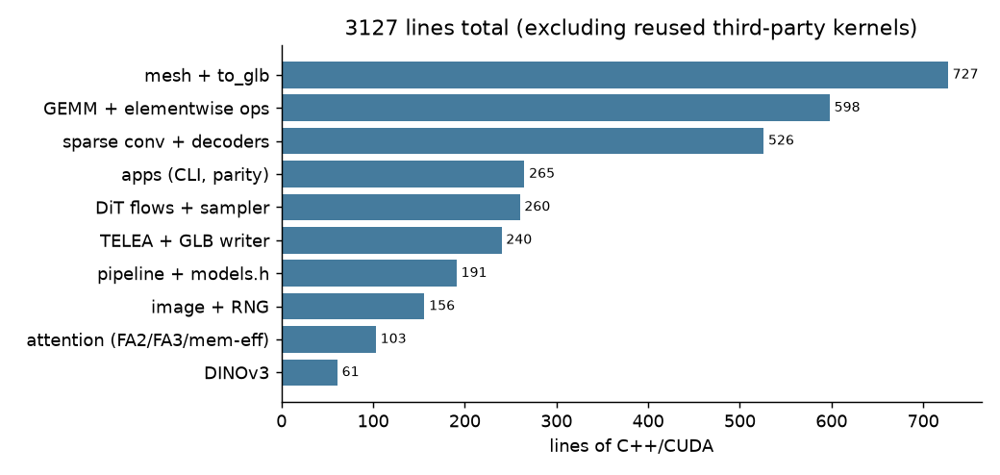

About 3.1k lines of C++/CUDA, plus a few small Python tools that run offline only (reference dumps, baseline timing,
GLB comparison, plots). The heavy kernels are reused rather than rewritten:

- flash-attention 2.7.3 (FA2 and FA3)
- ATen's mem-efficient attention
- cutlass
- cuBLASLt and cuDNN
- CuMesh, cuBVH and xatlas
- nvdiffrast's rasterizer
- FlexGEMM's grid-sample kernels
- libwebp

The hand-written parts are the ones where matching torch exactly needed control over op order: elementwise ops and
norms, the sparse-conv MMA kernel, sampling, preprocessing, RNG, TELEA and the GLB writer. The rest is new fast-build
code: LBVH and wavefront TELEA.

## 10. Cost

| Item | Cost |
|---|---|
| HF Jobs `h200`, 8.4 h at $5.00/h (all development, parity runs, benchmarks) | ~$42 |
| HF Jobs `cpu-performance`, 8.7 h at $1.90/h (started while the H200 was queued for 43 min) | ~$17 |
| HF Jobs `h200`, 58 min (fresh-container parity reproduction, section 12) | ~$5 |
| **Compute total** | **~$64** |
| Cursor model usage | not visible to the agent; see the Cursor dashboard |

One full 4-way benchmark pass over the five images is only about 24 GPU-minutes (~$2). Almost all of the compute bill
is development time on an always-on job.

## 11. Lessons

- **Parity is about the implementation, not the math.** Most of the work was finding which kernel, heuristic, rounding
  point or library version torch actually uses, then matching it: cuBLASLt vs cuBLAS by bias presence, cuDNN engine
  filtering, the AVX2 RNG on an AVX-512 host, Pillow's bundled libwebp, OpenCV's `sqrt` overloads.
- **Check stage by stage on reference inputs, then end to end.** Dumping every intermediate up front made each mismatch
  local and quick to bisect with deeper taps.
- **Know the official code's own noise floor.** Atomics in CuMesh make "bitwise" impossible for normals and simplify,
  even for the official code against itself. Measuring that floor turned a vague tolerance into concrete gates.
- **Profile the whole product, not just the model.** The headline 4B-parameter models were not the bottleneck. Serial
  CPU geometry processing was, and most of the 5.3× came from there.
- **Check what the container really gives you.** A 23-CPU quota behind a 192-core `nproc` quietly throttled every
  thread pool until it was handled.

## 12. Making parity reproducible

One dependency was left implicit. FlexGEMM's Triton kernels pick a tile configuration per shape by timing candidates,
and save the winner to a cache file. The timing is noisy, so two machines can choose different tiles, and different
tiles give different fp32 accumulation orders. Bitwise sparse-conv parity therefore means "the same tiles as the
reference run". During development that cache lived only on the job's disk.

The fix is to make it part of the repo:

- `assets/flexgemm_autotune.json` holds the H200 tile choices for the five example images.
- The CUDA build reads it by default (`T2_FLEXGEMM_CACHE` overrides).
- `tools/repro_parity.sh` points the official pipeline at the same file (`FLEX_GEMM_AUTOTUNE_CACHE_PATH`), so both
  sides use identical tiles. It also runs with `T2_STRICT=1`, which aborts on any shape missing from the cache instead
  of silently using a default.

To check this end to end, the whole thing was run again on a fresh H200 container, starting from an empty cache:

1. Reference setup, the CUDA build, and official dumps for all five images. These filled in the cache.
2. A second pass of every check against the frozen cache. Its md5 was unchanged afterwards, so the official runs read
   it without retuning.

| Image | `pipe` (image → mesh + attributes) | `glb` (remesh, UV unwrap) | `bake` (texture, TELEA, GLB bytes) |
|---|---|---|---|
| 0a34 | bitwise | bitwise | identical except normals |
| 0e49 | bitwise | bitwise | identical except normals |
| 0f16 | bitwise | bitwise | identical except normals |
| 130c | bitwise | bitwise | identical except normals |
| T.png | bitwise | bitwise | identical except normals |

"Except normals" is the atomic-accumulation gate from section 4. On 0a34, for example, 80 normals differed by more than
1e-5, well inside the 0.05% gate. The run also caught a harness bug: the `glb` check compared CuMesh `simplify` output, which is
nondeterministic, when it was only meant to report its size.

A new image or a different GPU needs one official run first, to add its tiles to the cache.

## Reproduce

```bash
tools/setup_ref.sh                       # official PyTorch reference (only for parity checks and baselines)
tools/build.sh build                     # fetches pinned third-party sources, builds build/t2 and build/parity
tools/repro_parity.sh build              # official dumps + bitwise checks on the 5 example images
./build/t2 image.png out.glb [seed]      # parity build
T2_FAST=1 ./build/t2 image.png out.glb   # fast build
```

Checkpoints are read from `$T2_CKPT`. Figures are produced by `tools/plot_bench.py`, `tools/render_glb.py` and
`tools/blog_figs.py`, and the chart and TELEA data comes from `T2_CHARTS` / `T2_TELEA` dumps in `bench/`.
